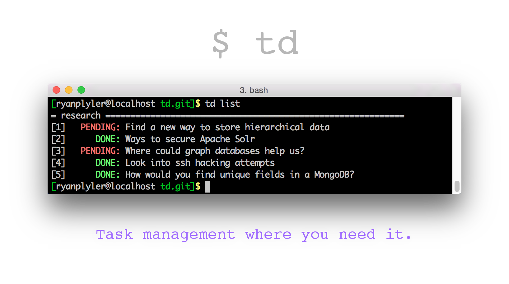

Before I wrote `td` I experimented with many todo managers. Mac Notes,
Mac Reminders, Google Tasks, and various Android Apps. But with every one
I had to leave my work in the command line, and change contexts just
to jot down a simple task.

At my job where I worked with a lot a fast changing data, python scripts,
`csv`, and `json` files, keeping track of what comes next and what stage of the data processing 
became non trivial.

I wrote `td` as a project based improvement over a previous directory
based todo manager named `todo`. Being able to keep track of the details as well as the big picture, without ever leaving the command line was a boon to me and I hope it can also serve you.

## Installation

```
$ git clone https://github.com/grplyler/td.git
$ cd td
$ python setup.py install
```

## Installation for development

```
$ git clone https://github.com/grplyler/td.git
$ cd td
$ python setup.py develop
```

This will give you a working installation you can use,
but python setuptools will create a link in your site-packages
directory allow you to make changes to the code live without reinstalling.

## Usage

Run `td` to see a help summary

```
$ td
Usage:
    td new <content>...
    td done <todo>
    td undo <todo>
    td rm (<todo> | --done)
    td revert (<todo> | --removed)
    td list [<project>] [--all] [--removed]
    td pro list
    td pro new <project_name>
    td pro rm <project_name>
    td chp <project_name>
    td reboot
    td init
    td debug
```

This pretty much tells you all you need to know in order to use
`td` the goal was a very simple command line interface with simple
and natural looking commands.

But your welcome to read on for more details and demos.

### Creating a new todo

```
$ td new Setup automatic notifications for system outages
```

This creates a todo in your default project (`default` by default )

### Listing todos

```
$ td list
= default ============================================================
[1]   PENDING: Setup automatic notifications for system outages
```

### Marking todo as done

`DONE` todos are highlighted in Green, `PENDING` ones are red.
Todos can be operated on by their `tid` identification number shown
on the left.

```
$ td done 1
$ td list
= default ============================================================
[1]      DONE: Setup automatic notifications for system outages
```

### Undoing todos

```
$ td undo 1
$ td list
= default ============================================================
[1]   PENDING: Setup automatic notifications for system outages
```

The todo will be pending again

### Removing todos

To clear a todo from the list you can remove it.
`td` doesn't actually delete it forever, but instead
marks it as invisible in the sqlite database.

```
$ td new Investigate logs for possible entry attempt
$ td list
= example ============================================================
[1]   PENDING: Setup automatic notification for system outages
[2]   PENDING: Investigate logs for possible entry attempt
$ td rm 1
Deleted Todo #1 from Project example.
$ td list
= example ============================================================
[2]   PENDING: Investigate logs for possible entry attempt
```

### Reverting Todos

Reverting in this case 
means you can show todos that you have removed.

```
$ td revert 1
Reverted 1 todo
$ td list
= example ============================================================
[1]      DONE: Setup automatic notification for system outages
[2]   PENDING: Investigate logs for possible entry attempt
```

### Creating a new project

You can create a new project implicitly by include the
project name followed by a `:`
as the first argument to the `new` command.

```
$ td new personal: Get a new hard drive to family pictures.
Todo added under project personal.
```

Or you can create the explicitly

```
$ td pro new personal
$ td pro list
  example
* personal
```

### Listing projects

```
$ td pro list
* example
  personal
```
The `*` marks your _current working project_

### Changing your Current Working Project

To change your current working project

```
$ td chp personal
Project Changed to personal
$ td list
= personal ============================================================
[3]   PENDING: Get a new hard drive for family pictures
```

_This number `3` is the unique ID of the todo_

### Reseting the todo database

This will delete and reinitialize you todo database in `~/.td/todos.db`

```
$ td reboot
Are you sure you want to reboot the database?(y/n): y
Rebooted database.
```

### Troubleshooting

`td` is quite usable but still in its early stages
To print some debugging information run:

```
$ td debug
```

## Improvements

Some areas that I would like to improve in the near future.

* Add the ability to operate on multiple todos at once
Something like `$ td done 1-4` and `$ td done 1,3,6,24`
or `td done <tid> ...`
* Network based, project orient todo manage with a a pluggable database like `MySQL` or `MongoDB`
* Improve error handling 

Please suggest any improvement you would like to see,
or fork the code and take a shot yourself!

**Thank you for your time and interest**


